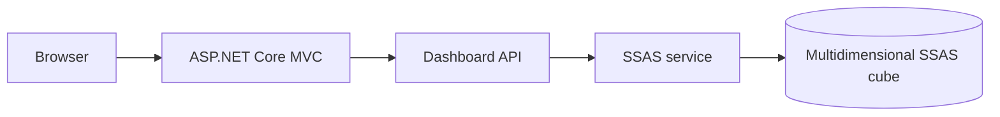
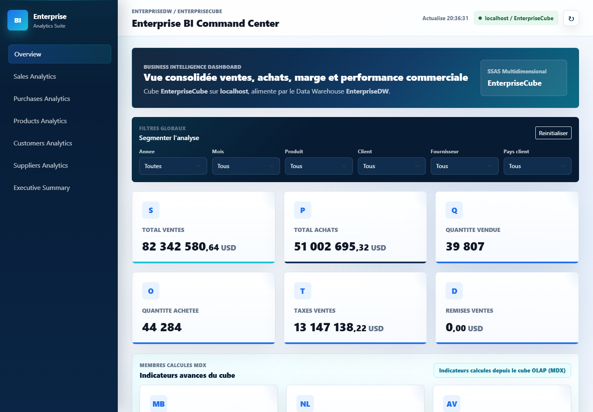
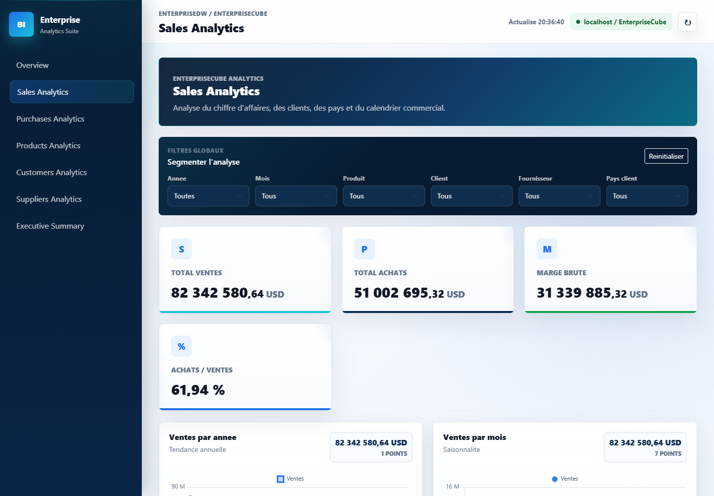

# Enterprise BI Dashboard

[](https://github.com/KhaledZouari/enterprise-bi-dashboard/actions/workflows/ci.yml)
[](LICENSE)

An ASP.NET Core decision-support application connected to a multidimensional SQL
Server Analysis Services cube.

## Purpose

The dashboard turns OLAP measures and dimensions into operational views for
sales, purchasing, products, customers, suppliers, employees, and time-based
analysis. It reports connection or query failures explicitly and never replaces
missing BI data with fabricated fallback values.

## Stack

- ASP.NET Core MVC and C#
- SQL Server Analysis Services (SSAS)
- ADOMD.NET and MDX
- Bootstrap, Chart.js, and JavaScript
- GitHub Actions for build verification

## Architecture



Controllers expose dashboard views and JSON endpoints. The SSAS service owns
connection handling, constrained member selection, MDX execution, and result
mapping. View models keep rendering concerns separate from cube access.

## Capabilities

- KPI overview and calculated cube measures
- Sales analysis by product, customer, employee, category, brand, color, size,
  country, status, year, month, and quarter
- Purchasing analysis by supplier, product, year, and month
- Sales-versus-purchases comparisons
- Top and low-performing product views
- Filters generated with constrained MDX member resolution

## Local setup

Prerequisites: .NET SDK and access to a Windows SSAS instance with the expected
cube deployed.

```bash
git clone https://github.com/KhaledZouari/enterprise-bi-dashboard.git
cd enterprise-bi-dashboard
dotnet restore
dotnet run --urls http://localhost:5244
```

Open `http://localhost:5244`. Configure the SSAS connection through
`appsettings.Development.json` or supported environment variables. Never commit
credentials.

## Verification

```bash
dotnet restore
dotnet build --no-restore --configuration Release
```

CI verifies the application build on pull requests. Integration queries require
a Windows SSAS instance and deployed cube, so hosted CI does not execute them.

## Reliability notes

- SSAS or MDX failures return a clear `503` response.
- Missing calculated measures display as `N/A`.
- Empty and error states remain distinct from valid zero values.
- Filter members are resolved with `StrToMember(..., CONSTRAINED)`.

## Business context and engineering approach

### Multidimensional business analysis

The dashboard translates SSAS cube measures into views for commercial and
purchasing analysis. ASP.NET Core exposes pages and JSON endpoints; the SSAS
service executes MDX and maps multidimensional results into chart and KPI
models.

Constrained MDX member resolution limits filter selection to valid cube members.
Missing calculated measures remain N/A and connection/query failures produce
explicit errors instead of fabricated fallback totals.

## Application screenshots

Captured from the running application on 3 October 2026.

### BI overview



Aggregate sales, purchases and global cube-dimension filters.

### Sales analysis



Dedicated sales-analysis view connected to the local SSAS cube.

## Evidence and current scope

These are actual local captures of the deployed academic EnterpriseCube.
Aggregate amounts describe that local dataset; they are not company revenue,
audited financial results or evidence of a production deployment.

## License

Distributed under the MIT License. See [LICENSE](LICENSE).
