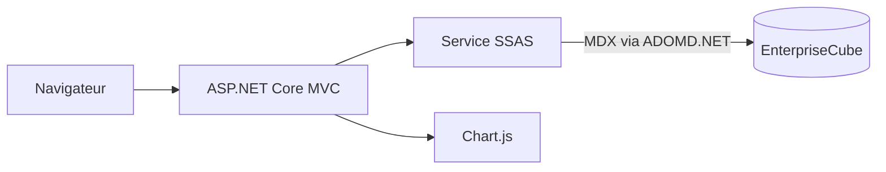

# Enterprise BI Dashboard

Application ASP.NET Core MVC qui transforme les données du cube SSAS
Multidimensional `EnterpriseCube` en indicateurs et analyses décisionnelles.

Le projet presente un dashboard BI universitaire sous une forme professionnelle
: KPI, filtres globaux, vues analytiques specialisees, graphiques Chart.js et
endpoints JSON pour toutes les analyses.

## Stack

- ASP.NET Core MVC `net8.0`
- C#
- ADOMD.NET : `Microsoft.AnalysisServices.AdomdClient.NetCore.retail.amd64`
- MDX
- Chart.js
- Bootstrap 5

## Configuration BI

```json
"SqlServer": {
  "Server": "DESKTOP-28L6KA8\\KHALED",
  "DataWarehouse": "EnterpriseDW"
},
"Ssas": {
  "ServerName": "localhost",
  "CubeName": "EnterpriseCube",
  "ConnectionString": "Data Source=localhost;Catalog=EnterpriseCube;Integrated Security=SSPI;",
  "CommandTimeoutSeconds": 60
}
```

Si la base SSAS ne porte pas le meme nom que le cube, modifier `Catalog` dans
`appsettings.json` et conserver `CubeName` pour le nom utilise dans
`FROM [EnterpriseCube]`.

## Architecture



```text
Controllers/
  DashboardController.cs
Models/
  ApiResponse.cs
  ChartDataPoint.cs
  ConnectionStatusModel.cs
  DashboardFilters.cs
  DashboardViewModel.cs
  FilterOption.cs
  FilterOptionsModel.cs
  KpiModel.cs
  SsasQueryResult.cs
Services/
  ISsasService.cs
  SsasService.cs
ViewModels/
  AnalysisPageViewModel.cs
Views/Dashboard/
  Index.cshtml
  Analysis.cshtml
  _ChartPanel.cshtml
  _FilterBar.cshtml
wwwroot/
  css/site.css
  js/dashboard.js
```

La logique MDX est centralisee dans `Services/SsasService.cs`. Les vues ne
contiennent pas de requetes MDX.

## Pages MVC

- `/` ou `/Dashboard/Index` : Dashboard general
- `/Dashboard/SalesAnalytics`
- `/Dashboard/PurchasesAnalytics`
- `/Dashboard/ProductsAnalytics`
- `/Dashboard/CustomersAnalytics`
- `/Dashboard/SuppliersAnalytics`
- `/Dashboard/ExecutiveSummary`

## Filtres globaux

La barre de filtres applique les dimensions suivantes aux endpoints compatibles
:

- Annee
- Mois
- Produit
- Client
- Fournisseur
- Pays client

Les valeurs de filtres sont chargees depuis le cube via `MEMBER_UNIQUE_NAME`.
Cela evite les erreurs lorsque le libelle affiche n'est pas la cle MDX du
membre.

## Endpoints JSON

```text
GET /api/dashboard/connection-status
GET /api/dashboard/filter-options
GET /api/dashboard/kpis
GET /api/dashboard/calculated-kpis
GET /api/dashboard/sales-by-product
GET /api/dashboard/top-products
GET /api/dashboard/low-products
GET /api/dashboard/sales-by-year
GET /api/dashboard/sales-by-month
GET /api/dashboard/sales-by-quarter
GET /api/dashboard/sales-by-customer
GET /api/dashboard/top-customers
GET /api/dashboard/sales-by-country
GET /api/dashboard/sales-by-status
GET /api/dashboard/purchases-by-supplier
GET /api/dashboard/top-suppliers
GET /api/dashboard/purchases-by-year
GET /api/dashboard/purchases-by-month
GET /api/dashboard/purchases-by-product
GET /api/dashboard/sales-vs-purchases
GET /api/dashboard/quantity-sales-vs-purchases
GET /api/dashboard/sales-by-employee
GET /api/dashboard/sales-by-category
GET /api/dashboard/sales-by-brand
GET /api/dashboard/sales-by-color
GET /api/dashboard/sales-by-size
```

Chaque endpoint renvoie :

```json
{
  "success": true,
  "message": null,
  "data": []
}
```

En cas d'erreur SSAS ou MDX, l'API renvoie `503` avec un message propre.
L'interface affiche ce message sans page blanche.

## KPI

Les KPI de base sont :

- total ventes : `[Measures].[Line Total - Fact Sales]`
- total achats : `[Measures].[Line Total]`
- quantite vendue : `[Measures].[Quantity]`
- quantite achetee : `[Measures].[Ordered Quantity]`
- taxes ventes : `[Measures].[Tax Amount]`
- remises ventes : `[Measures].[Discount Amount]`

La page Overview affiche separement 4 membres calcules directement depuis le
cube OLAP, sans les recalculer avec des `WITH MEMBER` dans le dashboard :

- marge brute : `[Measures].[Marge Brute]`
- quantite non livree : `[Measures].[Quantite Non Livree]`
- taux achats / ventes : `[Measures].[Taux Achats Ventes]`
- taux livraison : `[Measures].[Taux Livraison]`

Ces valeurs sont servies par :

```text
GET /api/dashboard/calculated-kpis
```

Si une mesure calculee est absente ou indisponible dans SSAS, l'endpoint reste
stable et l'interface affiche `N/A` pour la carte concernee.

## Dimensions MDX reellement detectees

Le cube deploye expose notamment :

```text
[Dim Date].[Year Number]
[Dim Date].[Month Name]
[Dim Date].[Quarter Number]
[Dim Product].[Product Code]
[Dim Product].[Category ID]
[Dim Product].[Brand ID]
[Dim Product].[Color]
[Dim Product].[Size]
[DimCustomer].[Company Name]
[DimCustomer].[Country]
[DimCustomer].[Customer Status]
[Dim Supplier].[Supplier Code]
[Dim Employee].[First Name]
```

Important : dans le cube deploye, la dimension client s'appelle `[DimCustomer]`,
pas `[Dim Customer]`. La hierarchie `[Dim Supplier].[Supplier Name]` n'est pas
exposee ; les analyses fournisseurs utilisent donc
`[Dim Supplier].[Supplier Code]`.

## Exemples MDX

### Ventes vs achats par annee

```mdx
SELECT { [Measures].[Line Total - Fact Sales], [Measures].[Line Total] } ON
COLUMNS, NON EMPTY ORDER( [Dim Date].[Year Number].[Year Number].MEMBERS, [Dim
Date].[Year Number].CURRENTMEMBER.MEMBER_CAPTION, BASC ) ON ROWS FROM
[EnterpriseCube]
```

### Top produits

```mdx
SELECT { [Measures].[Line Total - Fact Sales] } ON COLUMNS, NON EMPTY TOPCOUNT(
[Dim Product].[Product Code].[Product Code].MEMBERS, 10, [Measures].[Line Total
- Fact Sales] ) ON ROWS FROM [EnterpriseCube]
```

### Filtres

Les filtres sont generes avec `StrToMember(..., CONSTRAINED)` a partir des
`MEMBER_UNIQUE_NAME` fournis par SSAS :

```mdx
WHERE ( StrToMember('[Dim Date].[Year Number].&[2025]', CONSTRAINED) )
```

Quand un filtre concerne la meme hierarchie que l'axe affiche, le service
applique le membre directement sur l'axe `ROWS` pour eviter l'erreur SSAS
"hierarchie deja presente dans l'axe".

## Lancement

```powershell
git clone https://github.com/KhaledZouari/enterprise-bi-dashboard.git
cd enterprise-bi-dashboard
dotnet restore
dotnet run --urls http://localhost:5244
```

Ouvrir :

```text
http://localhost:5244
```

Dans Visual Studio, ouvrir `EnterpriseBIDashboard.csproj`, choisir le profil
`http` ou `https`, puis lancer avec `F5`.

## Verification

Commandes utiles :

```powershell
dotnet build
Invoke-WebRequest http://localhost:5244/api/dashboard/kpis
Invoke-WebRequest http://localhost:5244/api/dashboard/sales-vs-purchases
```

Checklist :

1. SQL Server Analysis Services est demarre.
2. `EnterpriseCube` est deploye et traite.
3. L'utilisateur Windows courant a les droits de lecture SSAS.
4. `/api/dashboard/connection-status` renvoie `isConnected: true`.
5. La page `/` affiche les KPI, graphiques et tableaux.

## Variables d'environnement

La configuration .NET accepte les variables suivantes. Voir `.env.example` pour
un modèle sans secret.

| Variable                      | Description                                |
| ----------------------------- | ------------------------------------------ |
| `SqlServer__Server`           | Instance SQL Server contenant l'entrepôt.  |
| `SqlServer__DataWarehouse`    | Nom de l'entrepôt de données.              |
| `Ssas__ServerName`            | Instance SQL Server Analysis Services.     |
| `Ssas__CubeName`              | Nom du cube utilisé dans les requêtes MDX. |
| `Ssas__ConnectionString`      | Chaîne de connexion ADOMD.NET.             |
| `Ssas__CommandTimeoutSeconds` | Délai maximal d'une requête MDX.           |

## Tests et qualité

```powershell
dotnet restore
dotnet build --no-restore --configuration Release
```

La CI reproduit ce build sur chaque pull request. Les requêtes d'intégration
nécessitent une instance SSAS Windows avec le cube déployé et ne sont donc pas
exécutées par la CI hébergée.

## Captures d'écran

Les futures captures sont regroupées dans `docs/screenshots/`.

## Choix techniques

- ADOMD.NET fournit l'accès natif au cube multidimensionnel depuis .NET.
- Les requêtes MDX sont centralisées dans un service plutôt que dans les vues.
- Les endpoints JSON séparent la récupération analytique du rendu Chart.js.

## Pistes d'amélioration

- Isoler la construction des requêtes MDX pour permettre des tests unitaires.
- Ajouter des tests d'intégration exécutés sur un runner Windows relié à SSAS.
- Externaliser entièrement les paramètres locaux hors des fichiers suivis.

## Licence

Ce projet est distribué sous licence MIT. Voir [LICENSE](LICENSE).

## Notes

Aucune donnee fallback n'est utilisee comme donnee BI. En cas d'erreur,
l'application affiche un etat d'erreur ou un etat vide, sans inventer de
valeurs.
