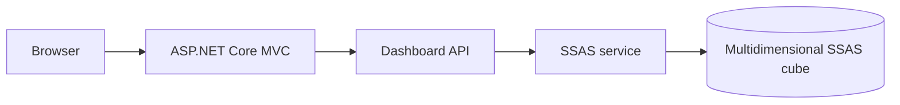

# Enterprise BI Dashboard

An ASP.NET Core decision-support application connected to a multidimensional
SQL Server Analysis Services cube.

## Purpose

The dashboard turns OLAP measures and dimensions into operational views for
sales, purchasing, products, customers, suppliers, employees, and time-based
analysis. It reports connection or query failures explicitly and never replaces
missing BI data with fabricated fallback values.

## Stack

- ASP.NET Core MVC and C#
- SQL Server Analysis Services (SSAS)
- ADOMD.NET and MDX
- Bootstrap, Chart.js, and JavaScript
- GitHub Actions for build verification

## Architecture



Controllers expose dashboard views and JSON endpoints. The SSAS service owns
connection handling, constrained member selection, MDX execution, and result
mapping. View models keep rendering concerns separate from cube access.

## Capabilities

- KPI overview and calculated cube measures
- Sales analysis by product, customer, employee, category, brand, color, size,
  country, status, year, month, and quarter
- Purchasing analysis by supplier, product, year, and month
- Sales-versus-purchases comparisons
- Top and low-performing product views
- Filters generated with constrained MDX member resolution

## Local setup

Prerequisites: .NET SDK and access to a Windows SSAS instance with the expected
cube deployed.

```bash
git clone https://github.com/KhaledZouari/enterprise-bi-dashboard.git
cd enterprise-bi-dashboard
dotnet restore
dotnet run --urls http://localhost:5244
```

Open `http://localhost:5244`. Configure the SSAS connection through
`appsettings.Development.json` or supported environment variables. Never
commit credentials.

## Verification

```bash
dotnet restore
dotnet build --no-restore --configuration Release
```

CI verifies the application build on pull requests. Integration queries require
a Windows SSAS instance and deployed cube, so hosted CI does not execute them.

## Reliability notes

- SSAS or MDX failures return a clear `503` response.
- Missing calculated measures display as `N/A`.
- Empty and error states remain distinct from valid zero values.
- Filter members are resolved with `StrToMember(..., CONSTRAINED)`.

## License

Distributed under the MIT License. See [LICENSE](LICENSE).

